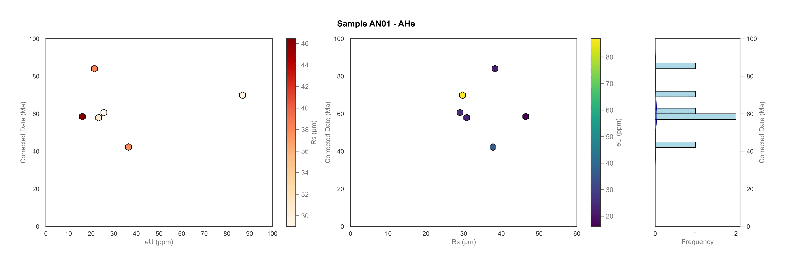
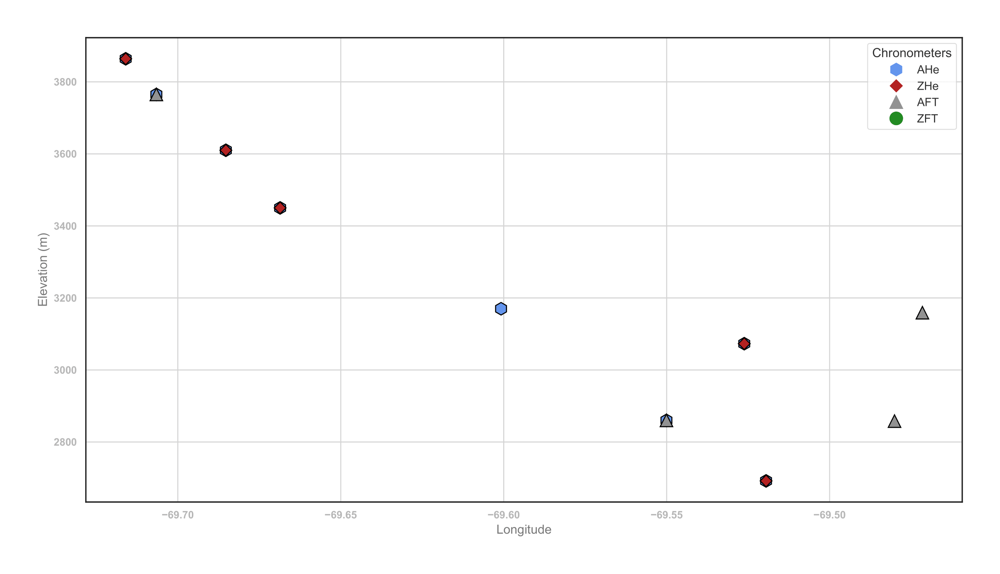
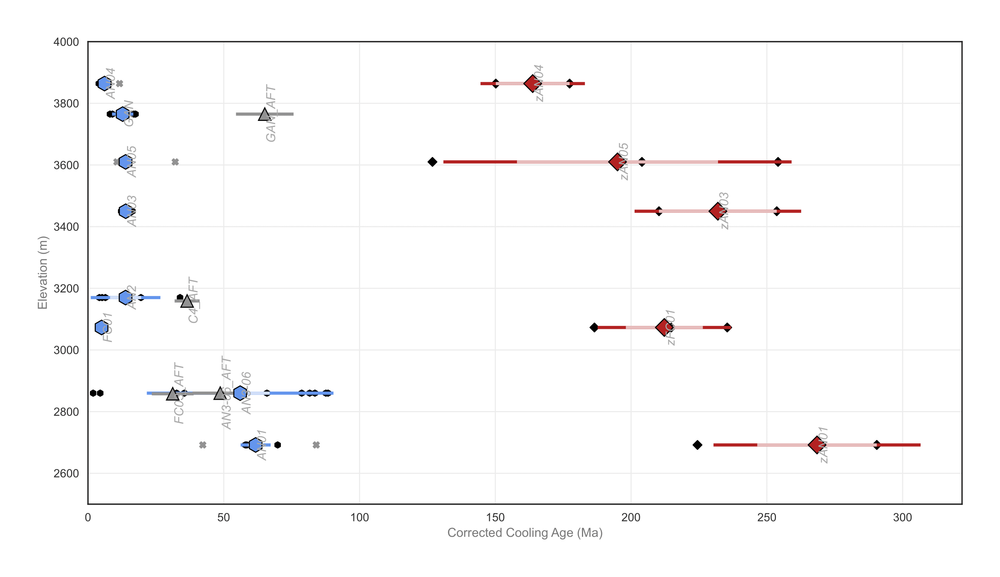
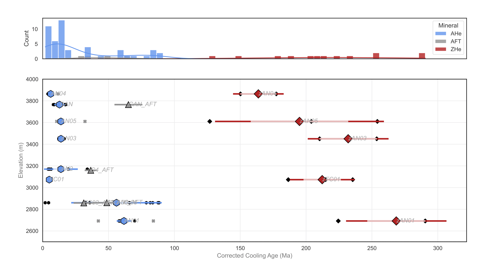
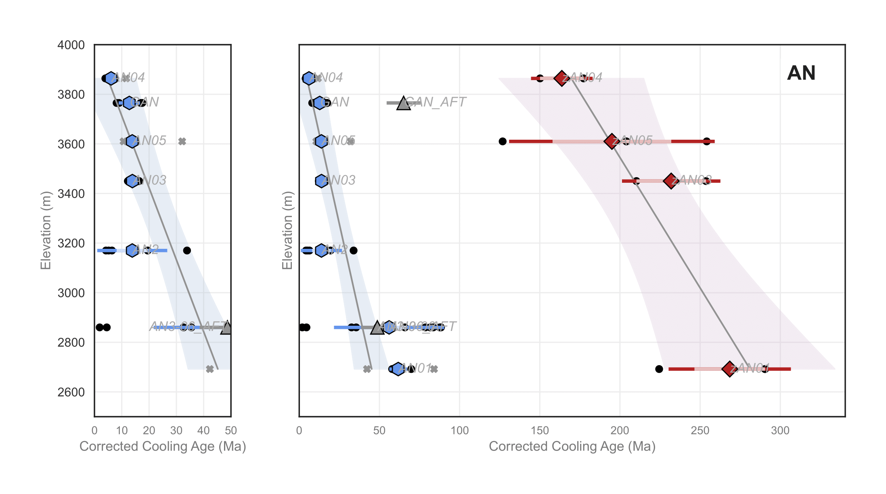

# <center> ThermoPy Data Analysis and Visualization Module </center>

## Description
ThermoPy is a Python-based program for analyzing and visualizing thermochronometric data. It provides tools for calculating summary statistics and creating publication-quality visualizations of thermochronology data.

## Installation

### Required Python Version
To run ThermoPy, we recommend using Anaconda, a comprehensive data science platform that includes most of the required Python modules (Python 3.6+).

### Full List of Dependencies
- Python 3.x
- pandas
- matplotlib
- seaborn  
- random
- numpy
- statsmodels
- scipy
- pathlib
- xlsxwriter
- typing

Install required packages using pip:
```python
pip install pandas matplotlib seaborn numpy statsmodels scipy pathlib xlsxwriter typing
```

## Data Formatting
thermoPy requires that input data be organized using a specific format. Example datasets can be found in the `example_data` folder. 

Input data should be in Excel format (.xlsx) with two worksheets:

1. **`Samples`** worksheet containing:
   - Sample metadata
   - Location information
   - Elevation data
   - Other sample-specific information

   The following columns are **necessary** to run the notebook
   - Sample
   - Transect
   - Mineral
   - Latitude
   - Longitude
   - Elevation_m

   The remaining columms are not required, but do offer additional plotting options within the notebook. 

2. **`Aliquots`** worksheet containing:
   - Individual aliquot measurements
   - Thermochronometric data
   - Sample references

   The following columns are **necessary** to run the notebook
   - Aliquot
   - Mineral
   - Sample
   - eU
   - Rs (or Rft)
   - Corrected_Date_Ma
   - Corrected_Uncertainty_1σ_Ma

### Sample Naming Convention

Sample IDs should include chronometer codes, especially when one sample has data for multiple chronometers:
- AHe: Base sample name (e.g., "AN01")
- ZHe: Prefix "z" (e.g., "zAN01") 
- AFT: Suffix "_AFT" (e.g., "AN01_AFT")
- ZFT: Suffix "_ZFT" (e.g., "AN01_ZFT")

## Usage

ThermoPy is designed to be used through Jupyter notebooks in a two-step workflow. 

### Notebook 1: Sample Statistics
#### 1. Load Data

```python
# Specify path to your Excel file
filepath = 'example_data/ThermoPy_example_data.xlsx'

# Load data from Excel
samples, sample_list, transect_list, aliquots = tFunc.loadDataExcel(filepath)

# View sample list to verify data loading
print(sample_list)
```

#### 2. Plot effective uranium and equivalent spherical radius for aliquots in dataset (Only for U-Th-He samples)

```python
# Plot eU vs Rs data for all He samples
radius = 'Rs'  # Options: 'Rs' or 'Rft'
plot_histogram = True
bin_width = 2
kde_overlay = True

# Filter for He samples only
all_He_samples = [sample_name for (sample_name, sample_type) in sample_list 
                 if 'HE' in sample_type.upper()]

# Create plots
tFunc.plot_samples_eU_Rft(all_He_samples, aliquots, radius, 
                         plot_histogram, bin_width, kde_overlay, 
                         savefig=False)
```

<p align="center">
  
</p>

#### 3. Analyze Outliers
Outliers may be assessed using the Inter-Quartile Range (IQR) or Chauvenet's Criterion methods of outlier detection. Both methods assume the data are **_normally distributed_**.

```python
# View outliers using IQR method
stat_scheme = 'IQR'
outliers_IQR = tFunc.viewOutliers(samples, aliquots, sample_list, stat_scheme)

# View outliers using Chauvenet's criterion
stat_scheme = 'Chauvenet'
outliers_Chauvenet = tFunc.viewOutliers(samples, aliquots, sample_list, stat_scheme)
```

#### 4. Calculate Statistics

```python
# Calculate statistics using IQR method
stat_scheme = 'IQR'
keep_all_outliers = False
aliquots_to_keep = None  # Specify aliquots to keep if needed
aliquots_to_reject = None  # Specify aliquots to reject if needed
save_data_excel = True
filename = 'summary_statistics_IQR.xlsx'

sample_stats, aliquot_stats = tFunc.calculateFullSummaryStats(
    samples, aliquots, sample_list,
    stat_scheme, keep_all_outliers,
    aliquots_to_keep, aliquots_to_reject,
    save_data_excel, filename
)
```

### Notebook 2: Data Visualization

First, load the summary statistics calculated in Notebook 1:

```python
# Load summary statistics
filepath = 'example_data/summary_statistics_IQR.xlsx'
samples, sample_list, transect_list, aliquots = tFunc.loadDataExcel(filepath)
```

#### 1. Create Elevation Profile

```python
# Plot elevation profile colored by chronometer
tFunc.plotElevationProfile(
    samples,
    x_variable='Longitude',
    transect=None,  # Plot all data
    colorBy='chronometer',
    x_bounds=None,
    y_bounds=None,
    label_samples=False,
    label_offset=(0, 0),
    AHeColor='cornflowerblue',
    ZHeColor='firebrick',
    AFTColor='gray',
    ZFTColor='forestgreen',
    savefig=False
)
```
<p align="center">
  
</p>

#### 2. Create Age vs Parameter Plot

```python
# Plot age vs structural level
tFunc.plotAgeVersus(
    samples, aliquots,
    x_variable='Age',
    y_variable='Elevation_m',
    transect=None,
    show_aliquots=True,
    weightedBy='unweighted',
    plot_SE=True,
    SE_basedOn='max',
    x_bounds=None,
    y_bounds=None,
    label_samples=True,
    savefig=False
)
```

<p align="center">
  
</p>

#### 3. Create Age Plot with Histogram

```python
# Plot age vs latitude with histogram
tFunc.plotAgeVersus_wHistogram(
    samples, aliquots,
    x_variable='Age',
    y_variable='Elevation_m',
    transect=None,
    show_aliquots=True,
    weightedBy='unweighted',
    plot_SE=True,
    bin_width=5,
    savefig=False
)
```

<p align="center">
  
</p>

#### 4. Create Regression Plot with Zoom

```python
# Plot age vs structural level with regression and zoom
tFunc.plot_AgeVersus_wZoomIn(
    samples, aliquots,
    transect='AN',
    y_variable='Elevation_m',
    inset_xlim=50,
    full_x_bounds=None,
    y_bounds=None,
    weightedBy='unweighted',
    plot_SE=True,
    AHe_regression=True,
    ZHe_regression=True,
    label_samples=True,
    savefig=False
)
```
<p align="center">
  
</p>


## References

Example data from:
- [Mackaman-Lofland, C., Lossada, A. C., Fosdick, J. C., Litvak, V. D., Rodríguez, M. P., del Llano, M. B., ... & Giambiagi, L. (2024). Unraveling the tectonic evolution of the Andean hinterland (Argentina and Chile, 30° S) using multi-sample thermal history models. Earth and Planetary Science Letters, 643, 118888.](https://www.sciencedirect.com/science/article/pii/S0012821X24003212?ref=pdf_download&fr=RR-2&rr=8f197268081f8bb5)

- [Lossada, A. C., Giambiagi, L., Hoke, G. D., Fitzgerald, P. G., Creixell, C., Murillo, I., ... & Suriano, J. (2017). Thermochronologic evidence for late Eocene Andean mountain building at 30 S. Tectonics, 36(11), 2693-2713.](https://agupubs.onlinelibrary.wiley.com/doi/pdfdirect/10.1002/2017TC004674)

- [Fosdick, J. C., Carrapa, B., & Ortíz, G. (2015). Faulting and erosion in the Argentine Precordillera during changes in subduction regime: Reconciling bedrock cooling and detrital records. Earth and Planetary Science Letters, 432, 73-83.](https://par.nsf.gov/servlets/purl/10156715)

Other References incldue:
- [R.M. Flowers, P.K. Zeitler, M. Danišík, P.W. Reiners, C. Gautheron, R.A. Ketcham, J.R. Metcalf, D.F. Stockli, E. Enkelmann, R.W. Brown; (U-Th)/He chronology: Part 1. Data, uncertainty, and reporting. GSA Bulletin 2022;; 135 (1-2): 104–136. doi: https://doi.org/10.1130/B36266.1](https://pubs.geoscienceworld.org/gsa/gsabulletin/article/135/1-2/104/613176/U-Th-He-chronology-Part-1-Data-uncertainty-and)

- [R.M. Flowers, R.A. Ketcham, E. Enkelmann, C. Gautheron, P.W. Reiners, J.R. Metcalf, M. Danišík, D.F. Stockli, R.W. Brown; (U-Th)/He chronology: Part 2. Considerations for evaluating, integrating, and interpreting conventional individual aliquot data. GSA Bulletin 2022;; 135 (1-2): 137–161. doi: https://doi.org/10.1130/B36268.1](https://pubs.geoscienceworld.org/gsa/gsabulletin/article/135/1-2/137/613175/U-Th-He-chronology-Part-2-Considerations-for)

- [Ketcham, R. A., Gautheron, C., & Tassan-Got, L. (2011). Accounting for long alpha-particle stopping distances in (U–Th–Sm)/He geochronology: Refinement of the baseline case. Geochimica et Cosmochimica Acta, 75(24), 7779-7791.](https://www.researchgate.net/profile/Cecile-Gautheron/publication/228085661_Accounting_for_long_alpha-particle_stopping_distances_in_U-Th-SmHe_geochronology_Refinement_of_the_baseline_case/links/5a7aec7745851541ce5f6e32/Accounting-for-long-alpha-particle-stopping-distances-in-U-Th-Sm-He-geochronology-Refinement-of-the-baseline-case.pdf)

- [Cooperdock, E. H., Ketcham, R. A., & Stockli, D. F. (2019). Resolving the effects of 2-D versus 3-D grain measurements on apatite (U–Th)/He age data and reproducibility. Geochronology, 1(1), 17-41.](https://gchron.copernicus.org/articles/1/17/2019/gchron-1-17-2019.pdf)

## Support

For questions and support, please email samrobbins13@gmail.com with a detailed description of the ask and any accompanying data necessary to provide support. All data will be kept in confidence. 

## License
ThermoPy is licensed under the Apache License 2.0.